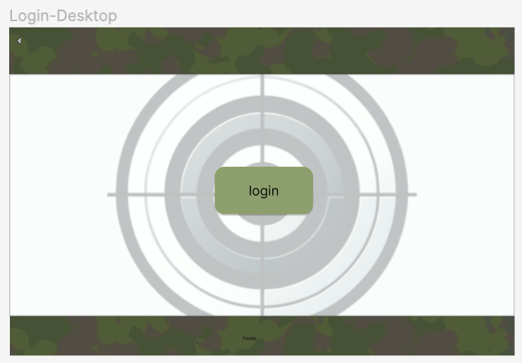
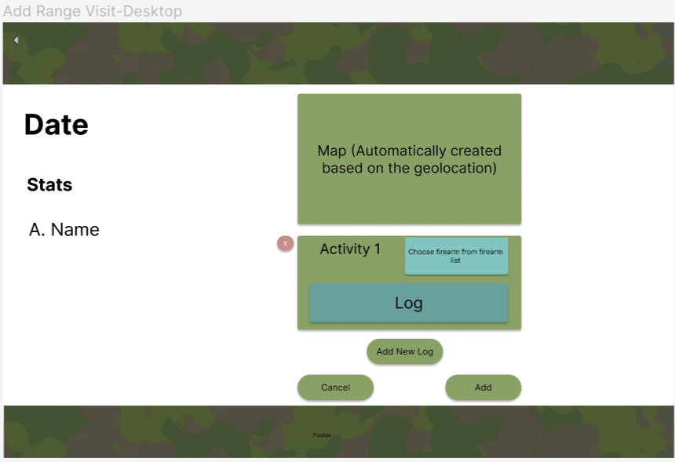

# Module 2 Group Assignment

CSCI 5117, Spring 2024, [assignment description](https://canvas.umn.edu/courses/413159/pages/project-2)

## App Info:

* Team Name: 403ForBidden
* App Name: TODO
* App Link: <https://TODO.com/>

### Students

* Jiyu Huang, huan2803@umn.edu
* Xizhen Kang, kang0552@umn.edu
* Ruichen He, he000239@umn.edu
* Zirui Chen, Chen6713@umn.edu
* Ziqi Zhou, zhou2045@umn.edu

## Key Features

**Describe the most challenging features you implemented
(one sentence per bullet, maximum 4 bullets):**

* ...

Which (if any) device integration(s) does your app support?

* ...

Which (if any) progressive web app feature(s) does your app support?

* ...

## Mockup images
### 1. Sign-in Page 
Phone View

Web View

When user first access the website without sign in/sign on, they will only get access to the Sign-in Page.

### 2. Home Page
Phone View

Web View

Once the user log in, they will get see the Home Page, which has three buttons, including "Firearm", "Range Visit", and "Gun Maintenance". By clicking each button, corresponding page will be shown. In addition, user can click the "logout" button on the right top corner to log out and back to the signin page. 

### 3. Firearm Inventory Page
Phone View

Web View

If user click the Firearm button on the Home Page, the Fire Inventory Page will be shown to them, which contains the list of firearms that user has, with some stats on the side. User can click each firearm block to access the firearm detail page. They can also click the Edit button and choose one firearm to edit/delete. There is another "+" Button on the bottom, which user can use to jump to Add Firearm Page. 

### 4. Firearm Detail Page
Phone View

Web View

Once user click one of the firearm listed in the Firearm Inventory Page, they will get access to the Firearm Detail Page, where they can see the detail of the selected firearm. In addition, they can also see the list of range visit related to this firearm and the maintainence history. All items in these two blocks are clickable, and give user access of that specific range visit or maintainence detail page. If they want to edit some detail, simply they just click the Edit button, and then edit the text reupload firearm image by clicking the firearm images. 

### 5. Add Firearm Page
Phone View

Web View

The "Add Firearm" page is accessible by tapping the "+" button located in the bottom right corner of the firearm inventory page. User can add a new firearm in this page. 

### 6. Shooting Range Visit Page
Phone view

Web View

Upon selecting the "Range Visits" feature from the main menu, the user will be navigated to the "Range Visits" overview. These cards detail key statistics from each session, including the type of firearm utilized, duration of the visit, total shots discharged, the average score achieved, and the financial expenditure.

Tapping on any card expands to a detailed summary of that particular visit, providing an in-depth review of performance and activity. For user convenience, an 'Edit' option is prominently positioned at the top of the screen, allowing for modifications or removal of any entry related to range visits.

At the footer of the screen lies a conspicuous "+" button; interacting with this icon facilitates the user in seamlessly adding new range visits to their log.

### 7. Range Visit Detail Page
Phone view

Web View

On the Range Visit Details Page, users can view specific details of their shooting session by clicking the Edit button at the top to make adjustments. The main content area displays the name of the range, a map indicating the location, date of visit, series number of firearms used, and more. The Activity Log section below records basic information about the visit, such as bullets fired, time spent, achievements scored.

### 8. Add Range Visit Page
Phone View

Web View

The "Add Range Visit" page is accessible by tapping the "+" button located in the bottom right corner of the shooting range visit page. User can add a new range visit in this page. 

### 9. Gun Maintenance Page
Phone view

Web View

The Maintenance page is designed to track firearm maintenance records. The layout has separate entries, each with the name of the gun and an accompanying image. The Statistics section below each image lists information related to the firearm's identity and maintenance, including make, model, type, serial number, details of last maintenance, and the date of that maintenance. Users can interact with each entry to get more details and optionally edit the record using the Edit button at the top of the page. The "+" button at the bottom allows for quick addition of new maintenance records.

### 10. Maintenance Detail Page
Phone view

Web View

The "Maintenance Detail Page" is a dedicated section for tracking the specifics of a firearm's maintenance history. The page header includes an 'Edit' button for updating details. Below the firearm's name, a photo provided. The "Stats" area lists important identifiers like make, model, type, serial number, and purchase price. The "Activity Log" section is designed to document and review the firearm's maintenance activities.

### 11. Add Maintenance History Page
Phone view

Web View

The "Add Maintenance" page is accessible by tapping the "+" button located in the bottom right corner of the gun maintenance page. On this page, users are prompted to select a firearm from their list, for which they wish to log maintenance details. The top field, clearly labeled for the selection of a firearm, and a larger text box below for entering the specifics of the maintenance log. At the bottom of the page, there are two buttons, "Cancel" to discard changes, and "Add" to save the new maintenance entry to the user's records. The consistent footer remains at the bottom, offering navigational consistency within the application.

## Testing Notes

**Is there anything special we need to know in order to effectively test your app? (optional):**

* ...

## Screenshots of Site (complete)

**[Add a screenshot of each key page](https://stackoverflow.com/questions/10189356/how-to-add-screenshot-to-readmes-in-github-repository)
along with a very brief caption:**

## External Dependencies

**Document integrations with 3rd Party code or services here.
Please do not document required libraries (e.g., React, Azure serverless functions, Azure nosql).**

* Library or service name: description of use
* ...

**If there's anything else you would like to disclose about how your project
relied on external code, expertise, or anything else, please disclose that
here:**

...
